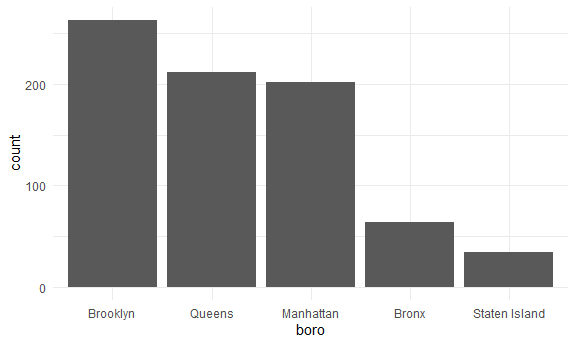
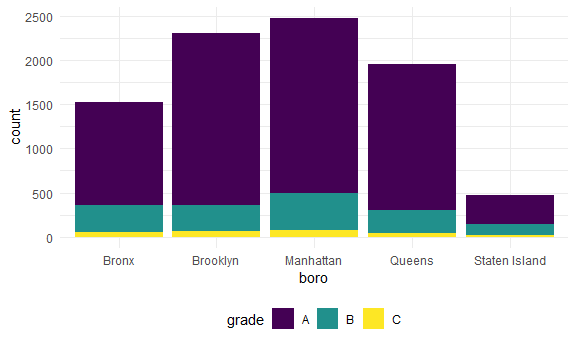
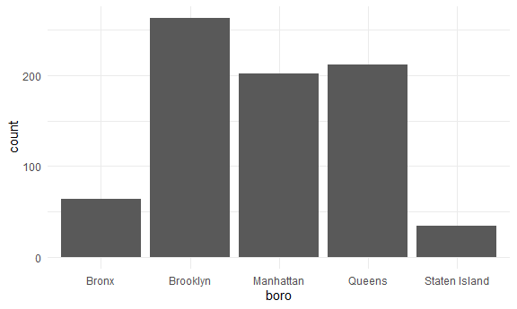
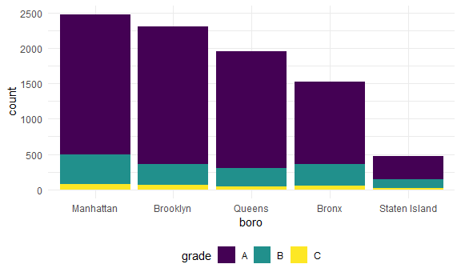
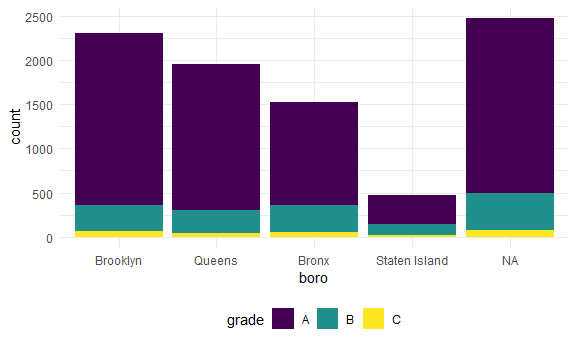
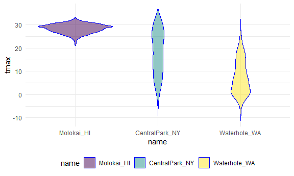
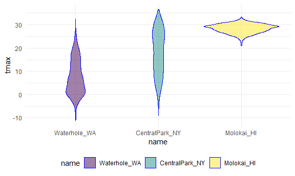

Strings and Factors
================
Sarahy Martinez
2024-10-16

If we are doing a logistic regression and we have a categorical we have
to assign one as a reference group and another not, so R built in
features for something that looks like character or string would factor
but not anymore so we have to do it our-self so we have to use the
stringr package.

Some common things

concatenating: joining snippets inot a long string shortening,
subsetting, or truncating changing cases replacing one string segment
with another

when you know a general pattenr but not an exact match you need to use
regular expressions - instead of looking for the letter “a” you might
look for any string that starts with a lower-case vowel

controlling factors is critical! - define reference group in models -
ordering variables in output - introducing new factor levels

common factor operations - converting character variable factors -
releveling by hand, or count, or by a second variable - renaming
levels - dropping unused levels

The forcats package is the way to go for majority of your factor needs

Load the necessary libraries.

``` r
library(rvest)  #data from web 
```

    ## 
    ## Attaching package: 'rvest'

    ## The following object is masked from 'package:readr':
    ## 
    ##     guess_encoding

``` r
library(p8105.datasets) # examples from this package
```

## Let’s do strings and regex

``` r
string_vec = c("my", "name", "is", "jeff")

# vectors that exist in 4 elements and everything is lowercase

str_detect(string_vec, "jeff")
```

    ## [1] FALSE FALSE FALSE  TRUE

``` r
#is it possible to identify the element of this string that corresponds to name. Use str_detect (presence or abscence of string)
# given a string or character observation can I detect a pattern 
# will report FALSE FALSE FALSE TRUE where it is detected last 

str_detect(string_vec, "e")
```

    ## [1] FALSE  TRUE FALSE  TRUE

``` r
# when detecting, does the pattern appear in any collection of characters kinda like control find


str_detect(string_vec, "J")
```

    ## [1] FALSE FALSE FALSE FALSE

``` r
#but if you are working with strings upper case anf lowercase will appear different, case sesitive. 

str_replace(string_vec, "jeff", "Jeff")
```

    ## [1] "my"   "name" "is"   "Jeff"

``` r
# name should be captialized, so can replace it with str_replace with capital 

str_replace(string_vec, "e", "E")
```

    ## [1] "my"   "namE" "is"   "jEff"

For exact matches , you can designate matches at the beginning or end of
file

``` r
# lets see diff ways we might detect in string vector
string_vec = c(
  "i think we all rule for participating",
  "i think i have been caught",
  "i think this will be quite fun actually",
  "it will be fun, i think"
  )

#see if we can detect i think 
str_detect(string_vec, "i think")
```

    ## [1] TRUE TRUE TRUE TRUE

``` r
#get four trues 

str_detect(string_vec, "^i think")
```

    ## [1]  TRUE  TRUE  TRUE FALSE

``` r
#lets take string I want to match and be more specific, string that starts with I think 

str_detect(string_vec, "i think$")
```

    ## [1] FALSE FALSE FALSE  TRUE

``` r
# string that ends withi think 
```

``` r
string_vec = c(
  "Y'all remember Pres. HW Bush?",
  "I saw a green bush",
  "BBQ and Bushwalking at Mongolo Gorge",
  "BUSH -- LIVE IN CONCERT !! "
)


str_detect(string_vec,"Bush" )
```

    ## [1]  TRUE FALSE  TRUE FALSE

``` r
str_detect(string_vec,"[Bb]ush" )
```

    ## [1]  TRUE  TRUE  TRUE FALSE

``` r
# detects both upper and lowercase bush
```

You can designate a list of characters that will count as a match

``` r
string_vec = c(
  "Time for a Pumpkin Spice Latte!",
  "went to the #pumpkinpatch last weekend",
  "Pumpkin Pie is obviously the best pie",
  "SMASHING PUMPKINS -- LIVE IN CONCERT!!"
  )


str_detect(string_vec, "pumpkin")
```

    ## [1] FALSE  TRUE FALSE FALSE

``` r
str_detect(string_vec, "Pumpkin")
```

    ## [1]  TRUE FALSE  TRUE FALSE

``` r
str_detect(string_vec, "PUMPKIN")
```

    ## [1] FALSE FALSE FALSE  TRUE

``` r
str_detect(string_vec, "[Pp]umpkin")
```

    ## [1]  TRUE  TRUE  TRUE FALSE

You don’t have to list these, instead you can provide a range of letters
or numbers that count as a match

``` r
string_vec = c(
  '7th inning stretch',
  '1st half soon to begin. Texas won the toss.',
  'she is 5 feet 4 inches tall',
  '3AM - cant sleep :('
  )

str_detect(string_vec, "[0-9][a-zA-Z]")
```

    ## [1]  TRUE  TRUE FALSE  TRUE

``` r
#what if we want to detect a number first followed immediately by a letter. Second line wont count becuase we have a number + space then letter
```

The character ( .) matches anything A lil weirder …

``` r
string_vec = c(
  'Its 7:11 in the evening',
  'want to go to 7-11?',
  'my flight is AA711',
  'NetBios: scanning ip 203.167.114.66'
  )

str_detect(string_vec, "7.11")
```

    ## [1]  TRUE  TRUE FALSE  TRUE

``` r
# we wanna detect all the 711, use the dot to separate the characters, and match anything so we dont need the carrot, except for the third because there is no special character in between 

# we want it to detect the dot like an actual dot legit , not another character


str_detect(string_vec, "7\\.1")
```

    ## [1] FALSE FALSE FALSE  TRUE

Some characters are “special”. These include \[ and \] , (and), and . .
If you want to search for these, you have to use the indicate they are
special using . Unfortunately,  is also special so things start to get
real strange

``` r
string_vec = c(
  'The CI is [2, 5]',
  ':-]',
  ':-[',
  'I found the answer on pages [6-7]'
  )

str_detect(string_vec, "\\[")
```

    ## [1]  TRUE FALSE  TRUE  TRUE

``` r
#if we want to detect an open bracket and its a special character so we have to double slash
```

There are a lot of other regular expression resources; we’re really only
scratching the surface. The stuff we have already will be useful and
it’s probably not worth going down the regex rabbit hole. That said,
it’s helpful to know what other functions exist in stringr – you should
at least know they exist even if you don’t know exactly how they work
right now!

## Factors …

Factors are maybe the least intuitive of R’s data types. They are very
useful, but they also do things you don’t expect; this is especially bad
when you have factors but think you have characters – which happens more
than you’d expect, because R uses factors a lot (mostly for historical
reasons). Folks get pretty riled up about factors.

Factors are the way to store categorical variables in R. They can take
on specific levels (e.g. male and female) which are usually presented as
characters but are, in fact, stored by R as integers. These integer
values are used by functions throughout R – in making plots, in
organizing tables, in determining the “reference” category – but most of
the time are hidden by easier-to-read character string labels. This
close relationship to strings, when in fact there is a lot of added
structure, is why factors can be so confusing.

This is the kind of thing that can get you in trouble

``` r
sex_vec = factor(c("male", "male", "female", "female"))

#given a collection R has implemented an order, uses alphabetical 


as.numeric(sex_vec)
```

    ## [1] 2 2 1 1

``` r
# takes your levels and saying underlying male is 2 and female is a 1 
```

What happens if I relevel some.. do some releveling …

``` r
sex_vec = fct_relevel(sex_vec, "male")

# made male the first category, male is listed as first level and female second 

as.numeric(sex_vec)
```

    ## [1] 1 1 2 2

``` r
# now male is 1 and female 2
# factors and behind scenes is most confusing and something R uses , they show up as numeric elements. Exist and matter but dont really see whats going on. 
```

The previous code also illustrates coersion: forcing a variable from one
type (e.g. factor) to another (e.g. numeric). Understanding how R
coerces variables is important, because it sometimes happens
unintentionally and can break your code or impact your analyses.

For this reason, it’s important to be deliberate factors, particularly
by using functions in forcats.

## Revisit a lot of examples!!

NSDUH

We’ll revisit the table scraped from the National Survey on Drug Use and
Health data on this page. In reading data from the web, we loaded this
data using the code below, but noted it wasn’t tidy.

Reading data from the web

``` r
url = "http://samhda.s3-us-gov-west-1.amazonaws.com/s3fs-public/field-uploads/2k15StateFiles/NSDUHsaeShortTermCHG2015.htm"

drug_use_html = read_html(url)

marj_use_df = 
  drug_use_html |> 
  html_table() |> 
  first() |> 
  slice(-1) 

# notice it is not a tidy dataset we the columns dont follow naming conventions etc. 
```

Get the pieces I actually need.

There are a few steps we need to implement to tidy these data. For now
I’m not interested in the p-values (I’d rather just see the data); we
also have age groups and year ranges in column titles, both of which
are, in fact, variables. Lastly, the table includes letters as
superscripts next to table entries; if we only want the percents we’ll
need to strip these out.

``` r
#tidying the data lines html to slice are reading in 
marj_use_df = 
  drug_use_html |> 
  html_table() |> 
  first() |> 
  slice(-1) |> 
  select(-contains("P Value")) |>   #removing everything that contain ( doing similar to str detect and giving exact string) 
  pivot_longer(
    cols = -State,
    names_to = "age_year",
    values_to = "percent"
  ) |> 
  separate(age_year, into = c("age", "year"), sep = "\\(") |>  # separating by open parenthesis,doesn't work bc its a special character \\
  mutate(
    year = str_replace(year, "\\)", ""), # we are updating now, we have trailing open parenthesis so we will replace 
    percent = str_remove(percent, "[a-c]$"), #updating the percent by removing the letters but be careful 
    percent = as.numeric(percent)
  ) 

# other way 
other_data_marj = 
  marj_use_df |>
  select(-contains("P Value")) |>
  pivot_longer(
    -State,
    names_to = "age_year", 
    values_to = "percent") |>
  separate(age_year, into = c("age", "year"), sep = "\\(") |>
  mutate(
    year = str_replace(year, "\\)", ""),
    percent = str_replace(percent, "[a-c]$", ""), #updating the percent by removing the letters but be careful 
    percent = as.numeric(percent)) |>
  filter(!(State %in% c("Total U.S.", "Northeast", "Midwest", "South", "West")))
```

We used stringr and regular expressions a couple of times above:

in separate, we split age and year at the open parentheses using “\\” we
stripped out the close parenthesis in mutate to remove character
superscripts, we replaced any character using “\[a-c\]\$” Let’s quickly
visualize these data for the 12-17 age group; to make the plot readable,
we’ll treat State as a factor are reorder according to the median
percent value.

\#NSDUH as factors

``` r
marj_use_df |> 
  filter(
    age == "12-17",
    !(State %in% c("Total U.S.", "South"))) |>   # state is character and not a factor so will place in alphabet order
  mutate(
    State = fct_reorder(State, percent)  # the , percent will make it the priority and put it order of prevelance
  ) |> 
  ggplot(aes(x = State, y = percent, color = year)) +   # color = year will fill in years as color ,will be the legend
  geom_point() + 
  theme(axis.text.x = element_text(angle = 90, vjust = 0.5, hjust = 1))   #axis rotate so labels are crammed 

# other way 

data_marj |>
  filter(age == "12-17") |> 
  mutate(State = fct_reorder(State, percent)) |> 
  ggplot(aes(x = State, y = percent, color = year)) + 
    geom_point() + 
    theme(axis.text.x = element_text(angle = 90, hjust = 1))
```

## NYC Restaurant Inspections

strings- restaraunt name, food, boro

``` r
data("rest_inspec")
```

``` r
rest_inspec |> 
  count(boro, grade) |> 
  pivot_wider(
    names_from = grade,
    values_from = n
  )
```

    ## # A tibble: 6 × 8
    ##   boro              A     B     C `Not Yet Graded`     P     Z  `NA`
    ##   <chr>         <int> <int> <int>            <int> <int> <int> <int>
    ## 1 BRONX         13688  2801   701              200   163   351 16833
    ## 2 BROOKLYN      37449  6651  1684              702   416   977 51930
    ## 3 MANHATTAN     61608 10532  2689              765   508  1237 80615
    ## 4 Missing           4    NA    NA               NA    NA    NA    13
    ## 5 QUEENS        35952  6492  1593              604   331   913 45816
    ## 6 STATEN ISLAND  5215   933   207               85    47   149  6730

``` r
# other way 

rest_inspec |> 
  group_by(boro, grade) |> 
  summarize(n = n()) |> 
  pivot_wider(names_from = grade, values_from = n)
```

    ## `summarise()` has grouped output by 'boro'. You can override using the
    ## `.groups` argument.

    ## # A tibble: 6 × 8
    ## # Groups:   boro [6]
    ##   boro              A     B     C `Not Yet Graded`     P     Z  `NA`
    ##   <chr>         <int> <int> <int>            <int> <int> <int> <int>
    ## 1 BRONX         13688  2801   701              200   163   351 16833
    ## 2 BROOKLYN      37449  6651  1684              702   416   977 51930
    ## 3 MANHATTAN     61608 10532  2689              765   508  1237 80615
    ## 4 Missing           4    NA    NA               NA    NA    NA    13
    ## 5 QUEENS        35952  6492  1593              604   331   913 45816
    ## 6 STATEN ISLAND  5215   933   207               85    47   149  6730

To simplify things, I’ll remove inspections with scores other than A, B,
or C, and also remove the restaurants with missing boro information.
I’ll also clean up boro names a bit.

``` r
rest_inspec =
  rest_inspec |> 
  filter(
    str_detect(grade, "[A-C]"),
    !(boro == "Missing")
  )

#other method 
rest_inspec =
  rest_inspec |>
  filter(grade %in% c("A", "B", "C"), boro != "Missing") |> 
  mutate(boro = str_to_title(boro))
```

Let’s focus only on pizza places for now, and re-examine grades by
borough.

``` r
rest_inspec |> 
  mutate(dba = str_to_sentence(dba)) |> 
  filter(str_detect(dba, "Pizza"))
```

    ## # A tibble: 775 × 18
    ##    action          boro  building  camis critical_flag cuisine_description dba  
    ##    <chr>           <chr> <chr>     <int> <chr>         <chr>               <chr>
    ##  1 Violations wer… Manh… 151      5.00e7 Not Critical  Pizza               Pizz…
    ##  2 Violations wer… Manh… 151      5.00e7 Critical      Pizza               Pizz…
    ##  3 Violations wer… Manh… 151      5.00e7 Critical      Pizza               Pizz…
    ##  4 Violations wer… Manh… 15       5.01e7 Critical      Pizza               & Pi…
    ##  5 Violations wer… Manh… 151      5.00e7 Critical      Pizza               Pizz…
    ##  6 Violations wer… Manh… 151      5.00e7 Not Critical  Pizza               Pizz…
    ##  7 Violations wer… Manh… 15       5.01e7 Critical      Pizza               & Pi…
    ##  8 Violations wer… Manh… 151      5.00e7 Critical      Pizza               Pizz…
    ##  9 Violations wer… Manh… 84       5.00e7 Not Critical  Pizza               Pizza
    ## 10 Violations wer… Manh… 525      5.01e7 Not Critical  Pizza               Pizz…
    ## # ℹ 765 more rows
    ## # ℹ 11 more variables: inspection_date <dttm>, inspection_type <chr>,
    ## #   phone <chr>, record_date <dttm>, score <int>, street <chr>,
    ## #   violation_code <chr>, violation_description <chr>, zipcode <int>,
    ## #   grade <chr>, grade_date <dttm>

``` r
#other example 
rest_inspec |> 
  filter(str_detect(dba, "Pizza")) |> 
  group_by(boro, grade) |> 
  summarize(n = n()) |> 
  pivot_wider(names_from = grade, values_from = n)
```

    ## `summarise()` has grouped output by 'boro'. You can override using the
    ## `.groups` argument.

    ## # A tibble: 5 × 3
    ## # Groups:   boro [5]
    ##   boro              A     B
    ##   <chr>         <int> <int>
    ## 1 Bronx             9     3
    ## 2 Brooklyn          6    NA
    ## 3 Manhattan        26     8
    ## 4 Queens           17    NA
    ## 5 Staten Island     5    NA

``` r
# That doesn’t look right – for sure there are more pizza place ratings than that! The problem is that the match in str_detect is case-sensitive until we tell it not to be:
rest_inspec |> 
  filter(str_detect(dba, "[Pp][Ii][Zz][Zz][Aa]")) |> 
  group_by(boro, grade) |> 
  summarize(n = n()) |> 
  pivot_wider(names_from = grade, values_from = n)
```

    ## `summarise()` has grouped output by 'boro'. You can override using the
    ## `.groups` argument.

    ## # A tibble: 5 × 4
    ## # Groups:   boro [5]
    ##   boro              A     B     C
    ##   <chr>         <int> <int> <int>
    ## 1 Bronx          1170   305    56
    ## 2 Brooklyn       1948   296    61
    ## 3 Manhattan      1983   420    76
    ## 4 Queens         1647   259    48
    ## 5 Staten Island   323   127    21

The table is okay but I’d like to visualize this.

``` r
rest_inspec |> 
  mutate(dba = str_to_sentence(dba)) |> 
  filter(str_detect(dba, "Pizza")) |> 
  mutate(boro = fct_infreq(boro)) |> 
  ggplot(aes(x = boro)) + 
  geom_bar()
```



``` r
#other example 

rest_inspec |> 
  filter(str_detect(dba, "[Pp][Ii][Zz][Zz][Aa]")) |>
  ggplot(aes(x = boro, fill = grade)) + 
  geom_bar() 
```



Might help to have things in a different order – maybe number of pizza
places? Fortunately this can be done using fct_infreq.

``` r
rest_inspec |> 
  mutate(dba = str_to_sentence(dba)) |> 
  filter(str_detect(dba, "Pizza")) |> 
  mutate(boro = fct_relevel(boro, "STATEN ISLAND")) |> 
  ggplot(aes(x = boro)) + 
  geom_bar()
```



``` r
# other example 
rest_inspec |> 
  filter(str_detect(dba, "[Pp][Ii][Zz][Zz][Aa]")) |>
  mutate(boro = fct_infreq(boro)) |>
  ggplot(aes(x = boro, fill = grade)) + 
  geom_bar() 
```



Renaming a borough

``` r
rest_inspec |> 
  mutate(dba = str_to_sentence(dba)) |> 
  filter(str_detect(dba, "Pizza")) |> 
  mutate(
    boro = fct_infreq(boro),
    boro = str_replace(boro, "MANHATTAN", "THE CITY")
    ) |> 
  ggplot(aes(x = boro)) + 
  geom_bar()
```


``` r
# other example 
rest_inspec |> 
  filter(str_detect(dba, "[Pp][Ii][Zz][Zz][Aa]")) |>
  mutate(
    boro = fct_infreq(boro),
    boro = str_replace(boro, "Manhattan", "The City")) |>
  ggplot(aes(x = boro, fill = grade)) + 
  geom_bar() 
```


``` r
# if we use base R 
rest_inspec |> 
  filter(str_detect(dba, "[Pp][Ii][Zz][Zz][Aa]")) |>
  mutate(
    boro = fct_infreq(boro),
    boro = replace(boro, which(boro == "Manhattan"), "The City")) |>
  ggplot(aes(x = boro, fill = grade)) + 
  geom_bar()
```



``` r
#That didn’t work at all! Factors have very specific values, trying to use a value that is not an existing factor level won’t work.

#Fortunately there is a dedicated function for renaming factor levels:

rest_inspec |> 
  filter(str_detect(dba, regex("pizza", ignore_case = TRUE))) |>
  mutate(
    boro = fct_infreq(boro),
    boro = fct_recode(boro, "The City" = "Manhattan")) |>
  ggplot(aes(x = boro, fill = grade)) + 
  geom_bar()
```


This renamed the borough, but then converted the result back to a string
– which, when plotted, was implicitly made a factor and ordered
alphabetically. I could switch the order in which I rename and encode
the factor order I want, but that might not always work.

``` r
rest_inspec |> 
  mutate(dba = str_to_sentence(dba)) |> 
  filter(str_detect(dba, "Pizza")) |> 
  mutate(
    boro = fct_infreq(boro),
    boro = fct_recode(boro, "THE CITY" = "MANHATTAN"),
    ) |> 
  ggplot(aes(x = boro)) + 
  geom_bar()
```


One last thing on factors…

``` r
rest_inspec |> 
  mutate(dba = str_to_sentence(dba)) |> 
  filter(str_detect(dba, "Pizza")) |> 
  mutate(boro = fct_infreq(boro)) |> 
  lm(zipcode ~ boro, data = _)
```

    ## 
    ## Call:
    ## lm(formula = zipcode ~ boro, data = mutate(filter(mutate(rest_inspec, 
    ##     dba = str_to_sentence(dba)), str_detect(dba, "Pizza")), boro = fct_infreq(boro)))
    ## 
    ## Coefficients:
    ##       (Intercept)         boroQueens      boroManhattan          boroBronx  
    ##           11222.4              147.9            -1196.9             -761.2  
    ## boroStaten Island  
    ##            -912.1

# WEATHER DATA

We saw factors in in Viz Pt 2. In that case, we were interested in
reordering a factor variable in order to produce clearer plots – ggplot
uses factor levels to determine the order in which categories appear.
Let’s revisit those examples now.

Our first step is to load the data we used.

``` r
weather_df = 
  rnoaa::meteo_pull_monitors(
    c("USW00094728", "USW00022534", "USS0023B17S"),
    var = c("PRCP", "TMIN", "TMAX"), 
    date_min = "2021-01-01",
    date_max = "2023-12-31") |>
  mutate(
    name = recode(
      id, 
      USW00094728 = "CentralPark_NY", 
      USW00022534 = "Molokai_HI",
      USS0023B17S = "Waterhole_WA"),
    tmin = tmin / 10,
    tmax = tmax / 10) |>
  select(name, id, everything())
```

    ## Registered S3 method overwritten by 'hoardr':
    ##   method           from
    ##   print.cache_info httr

    ## using cached file: C:\Users\sarah\AppData\Local/R/cache/R/rnoaa/noaa_ghcnd/USW00094728.dly

    ## date created (size, mb): 2024-09-26 23:39:45.766142 (8.668)

    ## file min/max dates: 1869-01-01 / 2024-09-30

    ## using cached file: C:\Users\sarah\AppData\Local/R/cache/R/rnoaa/noaa_ghcnd/USW00022534.dly

    ## date created (size, mb): 2024-09-26 23:40:09.008997 (3.94)

    ## file min/max dates: 1949-10-01 / 2024-09-30

    ## using cached file: C:\Users\sarah\AppData\Local/R/cache/R/rnoaa/noaa_ghcnd/USS0023B17S.dly

    ## date created (size, mb): 2024-09-26 23:40:17.640862 (1.038)

    ## file min/max dates: 1999-09-01 / 2024-09-30

``` r
weather_df |>
  mutate(name = forcats::fct_relevel(name, c("Molokai_HI", "CentralPark_NY", "Waterhole_WA"))) |> 
  ggplot(aes(x = name, y = tmax)) + 
  geom_violin(aes(fill = name), color = "blue", alpha = .5) + 
  theme(legend.position = "bottom")
```



We could instead reorder name according to tmax values in each name
using fct_reorder:

``` r
weather_df |>
  mutate(name = forcats::fct_reorder(name, tmax)) |> # re ordering based on tmax
  ggplot(aes(x = name, y = tmax)) + 
  geom_violin(aes(fill = name), color = "blue", alpha = .5) + 
  theme(legend.position = "bottom")
```



# Linear Regression

Although you may not have seen linear regression previously, the
ordering of factor variables play an important in this case as well.
Specifically, the ordering determines the “reference” category, and is
something that can be adjusted as needed.

Fit linear model where tmax is our outcome and weather station name is a
preditor, should fit a linear regression

``` r
weather_df |>
  lm(tmax ~ name, data = _)
```

    ## 
    ## Call:
    ## lm(formula = tmax ~ name, data = weather_df)
    ## 
    ## Coefficients:
    ##      (Intercept)    nameMolokai_HI  nameWaterhole_WA  
    ##            17.87             10.53            -10.31

``` r
#r needs to know reference group so we need to factor bc in first we dont see central park bc its a reference. Now we factor to change the references.

weather_df |>
  mutate(name = forcats::fct_relevel(name, c("Molokai_HI", "CentralPark_NY", "Waterhole_WA"))) |> 
  lm(tmax ~ name, data = _)
```

    ## 
    ## Call:
    ## lm(formula = tmax ~ name, data = mutate(weather_df, name = forcats::fct_relevel(name, 
    ##     c("Molokai_HI", "CentralPark_NY", "Waterhole_WA"))))
    ## 
    ## Coefficients:
    ##        (Intercept)  nameCentralPark_NY    nameWaterhole_WA  
    ##              28.40              -10.53              -20.84

# Pulse Data

Let’s revisit a dataset we’ve seen a few times now. In tidy data we
spent some time tidying the PULSE dataset. As part of that we used tools
available to us at the time, but now we have some better tools.

The code below updates the data processing pipeline for the PULSE data
using stringr and forcats. The result is the same, and the differences
are pretty small, but this is a bit cleaner.

``` r
pulse_data = 
  haven::read_sas("./data/public_pulse_data.sas7bdat") |>
  janitor::clean_names() |>
  pivot_longer(
    bdi_score_bl:bdi_score_12m,
    names_to = "visit", 
    names_prefix = "bdi_score_",
    values_to = "bdi") |>
  select(id, visit, everything()) |>
  mutate(
    visit = str_replace(visit, "bl", "00m"),
    visit = factor(visit)) |>
  arrange(id, visit)

print(pulse_data, n = 12)
```

# Airbnb

We could also use factors in an exploratory analysis of the Airbnb data,
for example when looking at the distribution of prices in various
neighborhoods. Ordering these according to the median price makes for
clearer plots than ordering neighborhoods alphabetically.

``` r
data("nyc_airbnb")

nyc_airbnb |>
  filter(neighbourhood_group == "Manhattan") |> 
  mutate(
    neighbourhood = fct_reorder(neighbourhood, price)) |> 
  ggplot(aes(x = neighbourhood, y = price)) +
  geom_boxplot() +
  coord_flip() + 
  ylim(0, 1000)
```
